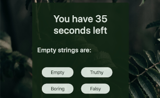

# Code Quiz

## Description

A timed quiz with various coding questions, users try to beat the clock for a high score.

## [Try it yourself!](https://bfeliz.github.io/code-quiz/)

The following image shows a glimpse of the application:

## Getting Started

This is a simple application that runs right in the browser, no installation or downloads needed.

## Built With:

JavaScript - programming language  
Bootstrap - CSS Framework

## Author:

Brittany Fortner  
See commit history [here](https://github.com/bfeliz/code-quiz/graphs/contributors).

## Planned Updates

There are no plans to further update this application at this time.
